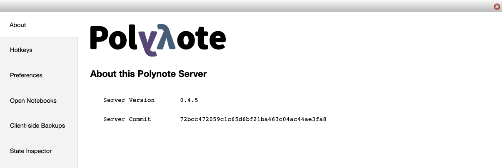
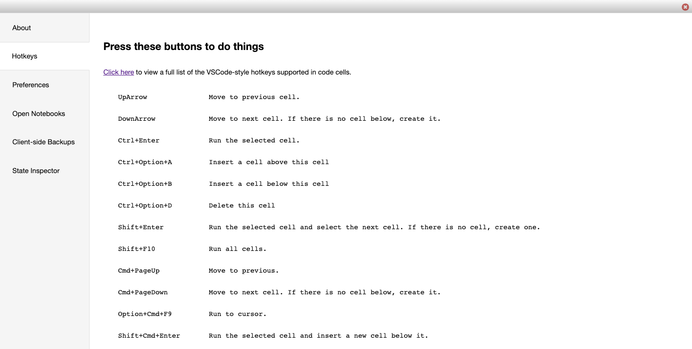
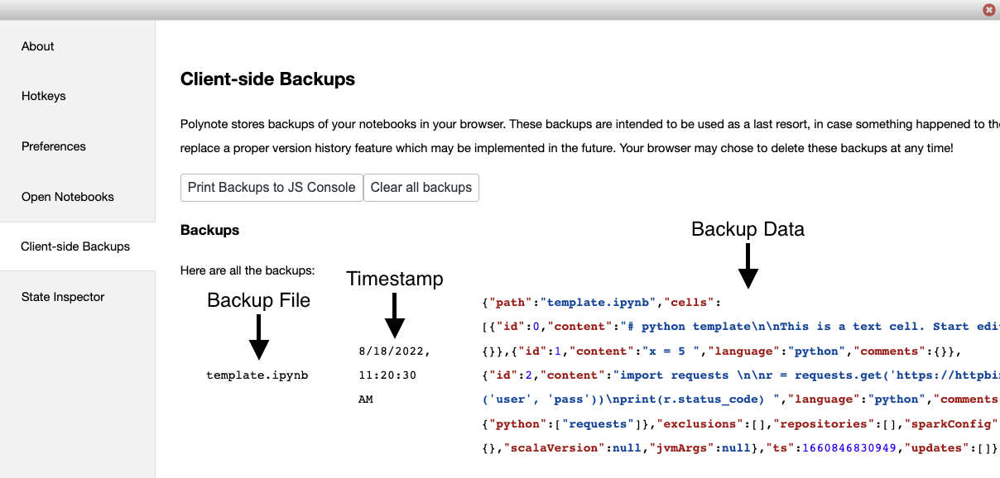

The about menu provides a deeper view into your instance of Polynote. It can be accessed from the [Toolbar](toolbar.md).

{: .centered-image } 

### Overview
The left pane contains several sections to view different pieces of data about Polynote.

### About 
The about menu contains information about your instance's version and most recent server commit. 

{: .centered-image }

### Hotkeys 
The hotkeys menu contains a list of all supported keyboard shortcuts in Polynote. 

{: .centered-image }

### Preferences 
The preferences menu contains two sections - _UI preferences_ and _storage_.

#### UI Preferences 
The preferences menu is where you can customize your **vim**, **theme**, and **notifications** preferences as seen below. 

Note that these preferences are stored in the
browser. You can clear these settings by using the `Clear All Preferences and Storage` button.

#### Storage 
The storage menu displays key-value pairs of all the data Polynote it storing in your browser's local storage, 
and provides easy access to wipe that data. 

{: .centered-image }

### Open Notebooks 
The open notebooks menu contains a list of all open notebooks alongside their kernel status. A notebook is considered open 
if any client has it open, or if there is a running kernel associated with it. 

This means the menu can be used to list notebooks not open in this particular browser, or to find running kernels you 
might have forgotten about. 

Note that the server keeps a notebook open for 30 seconds after it was last closed.  

{: .centered-image }

### Client-side Backups 
The client-side backups menu contains a list of all the client-side backups that Polynote occasionally creates of your 
notebooks and stores in your browser. This pane may take a long time to load if you have many backups. 

These backups are intended to be used as a last resort, in case something happened to the physical files on disk. 
This is not intended to replace a proper version history feature which may be implemented in the future. 
Your browser may chose to delete these backups at any time!

You can also print these backups to your console in JSON format, or clear all previous backups. Unfortunately, 
there is no easy way at this time to recover a backup - you will need to manually parse the JSON (which is not in 
`.ipynb` format). 

{: .centered-image }

### State Inspector 
The state inspector menu shows the current state of the server, as well as each notebook you have. This is mostly useful 
for debugging purposes and reporting errors. 
